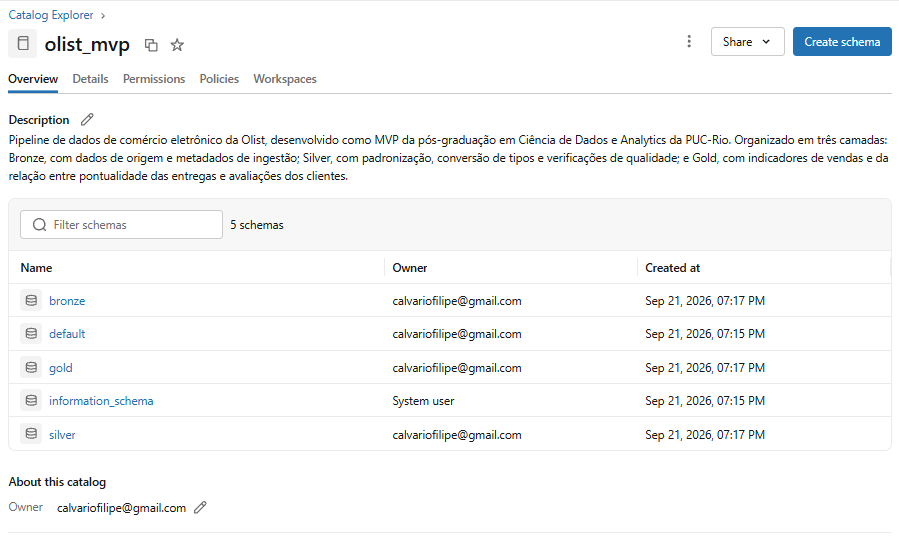
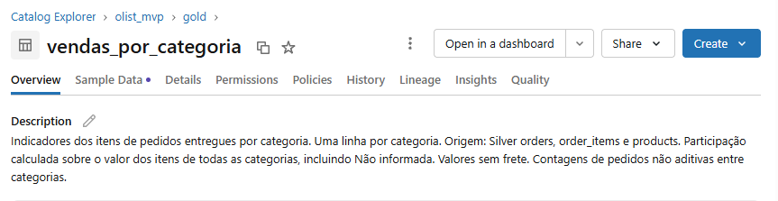
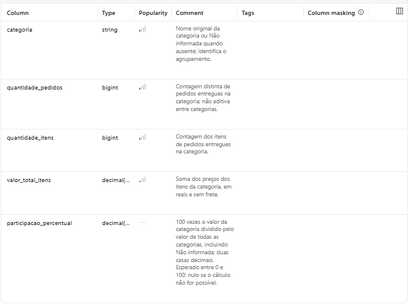

# Olist: pipeline de dados e análise de vendas no Databricks

**Autor:** Filipe Ferreira Calvario  
**Curso:** Pós-graduação em Ciência de Dados e Analytics — PUC-Rio  
**Projeto:** MVP de Engenharia de Dados

Este projeto desenvolve um pipeline de dados em Python e PySpark no Databricks, utilizando oito arquivos CSV do conjunto público de comércio eletrônico da Olist. O objetivo é transformar registros de clientes, pedidos, itens, pagamentos, avaliações, produtos e vendedores em informações organizadas e adequadas à análise de vendas e entregas.

O processamento está estruturado em três camadas: **Bronze**, que preserva os dados recebidos e registra sua origem; **Silver**, que padroniza os campos, converte os tipos e verifica a qualidade dos registros; e **Gold**, que reúne os indicadores utilizados nas análises. As tabelas são armazenadas em formato Delta, e suas descrições são registradas no catálogo do Databricks.

Além da construção do pipeline, o trabalho examina como as características dos dados influenciam os resultados. Campos ausentes, datas inconsistentes e diferenças entre as unidades de registro exigem decisões explícitas de tratamento e agregação. Por isso, os notebooks apresentam os procedimentos adotados, os diagnósticos encontrados e as interpretações dos resultados, permitindo acompanhar o caminho entre os arquivos de origem e os indicadores finais.

A análise aborda três aspectos do negócio: a evolução mensal das vendas, a participação das categorias de produtos e a relação entre pontualidade das entregas e avaliações dos clientes. Entre os resultados, os pedidos entregues no prazo apresentaram nota média de **4,29**, contra **2,27** nos pedidos atrasados. As dez categorias com maior valor de itens vendidos concentraram **62,43%** do total analisado.

Esses resultados são interpretados dentro dos limites da base histórica e dos critérios de inclusão adotados. O projeto busca demonstrar tanto a construção de uma base analítica rastreável quanto o cuidado necessário para comunicar o significado dos indicadores.

## 1. Contexto de Negócios e Perguntas

Em um comércio eletrônico, acompanhar o desempenho comercial envolve mais do que contar pedidos ou somar valores vendidos. É necessário compreender quando as compras ocorreram, quais produtos contribuíram para as vendas e como a experiência de entrega se relacionou com a avaliação dos clientes. Essas perspectivas permitem identificar padrões e formular questões para investigações posteriores.

As informações necessárias estão distribuídas em tabelas com diferentes unidades de registro, ou granularidades. Um pedido pode conter vários itens, possuir mais de um registro de pagamento e estar associado a múltiplas avaliações. Combinar essas tabelas diretamente, sem considerar suas relações, pode multiplicar registros e distorcer somas, contagens e médias.

A qualidade dos dados também interfere na interpretação. Uma data de entrega ausente pode estar relacionada a um pedido ainda não entregue ou a uma inconsistência de preenchimento. Da mesma forma, a ausência de comentário em uma avaliação não significa que sua nota esteja indisponível. O tratamento precisa considerar o significado dos campos e a finalidade de cada análise, evitando exclusões ou preenchimentos sem justificativa.

Nesse contexto, o objetivo do projeto é construir uma base analítica rastreável para acompanhar o desempenho comercial e investigar sua relação com a experiência do cliente. A organização em camadas permite preservar os registros de origem, documentar as transformações e aplicar critérios específicos na construção dos indicadores.

### Perguntas de negócio

**1. Como evoluíram os pedidos e o valor dos itens vendidos por mês?**

A análise mensal busca identificar mudanças no volume de pedidos e no valor dos itens vendidos ao longo do período disponível. A observação conjunta dessas medidas ajuda a avaliar se suas trajetórias são semelhantes e a localizar meses que mereçam investigação. Picos ou quedas podem motivar análises adicionais, mas não permitem, isoladamente, atribuir causas a campanhas, sazonalidade ou mudanças na operação.

**2. Quais categorias apresentaram maior valor de itens vendidos e qual sua participação no total?**

A comparação entre categorias busca compreender a distribuição do valor vendido e seu grau de concentração. Esse recorte permite identificar quais grupos de produtos têm maior expressão comercial na base e orientar o acompanhamento de seu desempenho. O ranking, entretanto, não mede lucratividade, pois não incorpora custos, comissões ou margens.

**3. Como as notas das avaliações se relacionam com os atrasos nas entregas?**

A comparação entre pedidos entregues no prazo e com atraso investiga a associação entre pontualidade e avaliação do cliente. A análise pode indicar a relevância de aprofundar o acompanhamento das entregas, mas não isola o efeito do atraso: características dos produtos, vendedores, regiões e outros fatores também podem influenciar as notas.

### Escopo e critérios de interpretação

As análises consideram pedidos com status `delivered`. Dessa forma, os resultados descrevem o recorte de pedidos entregues, sem abranger o desempenho de pedidos cancelados ou de outras situações operacionais.

O valor dos itens vendidos corresponde à soma de `price`, sem frete, e **não representa receita líquida ou lucro da Olist**. Na evolução mensal, os pedidos são agrupados pelo mês de realização da compra. Na análise por categoria, um mesmo pedido pode contribuir para mais de uma categoria quando contém produtos de grupos diferentes; por isso, as contagens de pedidos por categoria não devem ser somadas como se fossem pedidos distintos.

A comparação de pontualidade utiliza apenas pedidos com as datas necessárias preenchidas e cronologicamente consistentes. Quando há mais de uma avaliação válida para um pedido, calcula-se primeiro sua nota média, de modo que cada pedido avaliado tenha o mesmo peso na comparação.

A relação entre atraso e nota é **descritiva e não demonstra causalidade**. Os resultados se referem ao conjunto histórico disponibilizado pela Olist e não devem ser generalizados automaticamente para todo o comércio eletrônico brasileiro ou para o cenário atual.

## 2. Carga dos Dados

### Fonte e escopo

Os dados são provenientes do [Brazilian E-Commerce Public Dataset by Olist](https://www.kaggle.com/datasets/olistbr/brazilian-ecommerce), disponibilizado pela Olist no Kaggle. O conjunto contém dados históricos de comércio eletrônico entre 2016 e 2018; esse período decorre da cobertura da fonte, não de uma seleção de dados atuais.

A licença informada pela fonte é [CC BY-NC-SA 4.0](https://creativecommons.org/licenses/by-nc-sa/4.0/). O crédito dos dados pertence à Olist. As transformações realizadas neste projeto estão descritas nos notebooks e no catálogo. Os CSVs originais não estão incluídos neste repositório e devem ser obtidos na fonte indicada.

| Arquivo CSV | Tabela de origem | Linhas na Bronze |
|---|---|---:|
| olist_customers_dataset.csv | customers | 99.441 |
| olist_orders_dataset.csv | orders | 99.441 |
| olist_order_items_dataset.csv | order_items | 112.650 |
| olist_order_payments_dataset.csv | payments | 103.886 |
| olist_order_reviews_dataset.csv | reviews | 99.224 |
| olist_products_dataset.csv | products | 32.951 |
| olist_sellers_dataset.csv | sellers | 3.095 |
| product_category_name_translation.csv | category_translation | 71 |

O arquivo de geolocalização não integra o escopo. As tabelas têm granularidades diferentes; suas contagens não devem ser interpretadas como quantidades de pedidos independentes.

### Armazenamento em nuvem

Os CSVs foram carregados manualmente no volume `/Volumes/olist_mvp/bronze/raw_files`, no Databricks Free Edition. A ingestão verifica a presença dos oito arquivos e utiliza cabeçalho, UTF-8, suporte a campos com múltiplas linhas e modo `FAILFAST`.

Na Bronze, a inferência de tipos é desativada e os campos de origem permanecem como texto. São acrescentados `_source_file` e `_ingestion_timestamp`. Os dados são gravados como tabelas Delta no catálogo `olist_mvp`.

## 3. Modelagem e Catálogo de Dados

A modelagem preserva as entidades e suas granularidades nas camadas Bronze e Silver. A Gold contém três tabelas agregadas, orientadas às perguntas analíticas. Não foi implementado um esquema estrela.



*Catálogo do projeto no Databricks, com os esquemas Bronze, Silver e Gold.*

| Tabela Bronze/Silver | Granularidade | Chave observada |
|---|---|---|
| customers | Cadastro associado ao pedido | customer_id |
| orders | Pedido | order_id |
| order_items | Item do pedido | order_id + order_item_id |
| payments | Registro de pagamento do pedido | order_id + payment_sequential |
| reviews | Avaliação associada a um pedido | review_id + order_id |
| products | Produto | product_id |
| sellers | Vendedor | seller_id |
| category_translation | Tradução de categoria | product_category_name |

`customer_unique_id` permite identificar um cliente entre compras. `customer_id` é utilizado na associação do cadastro ao pedido. As chaves acima foram verificadas na base; não foram impostas restrições de chave primária ou estrangeira no banco.

As relações principais ligam `orders` a `customers`, `order_items` a `orders`, `products` e `sellers`, e `payments` e `reviews` a `orders`. A correspondência das categorias de `products` com `category_translation` também é verificada, embora a Gold utilize os nomes originais.

| Tabela Gold | Granularidade | Origem na Silver |
|---|---|---|
| vendas_mensais | Mês da compra | orders e order_items |
| vendas_por_categoria | Categoria | orders, order_items e products |
| avaliacoes_por_atraso | Situação de pontualidade | orders e reviews |

O [catálogo de dados](./04_catálogo_dados.ipynb) documenta as **19 tabelas e 158 campos**, contando as ocorrências dos campos em cada tabela. Inclui significados, tipos reais, domínios esperados, chaves, fórmulas e linhagem. As descrições também foram registradas nas tabelas e colunas do catálogo do Databricks.

### Documentação no Databricks

As capturas abaixo exemplificam a documentação da tabela
`olist_mvp.gold.vendas_por_categoria` no catálogo do Databricks.



*Descrição da tabela, origem dos dados e critérios dos indicadores.*



*Definições das cinco colunas e observações sobre o cálculo dos indicadores.*

## 4. Pipeline de Dados

| Etapa | Responsabilidade | Notebook |
|---|---|---|
| Bronze | Ingestão e diagnóstico de completude, duplicatas, chaves e referências | [01_bronze_ingestão.ipynb](./01_bronze_ingestão.ipynb) |
| Silver | Padronização, conversão de tipos e verificações de consistência e valores atípicos | [02_silver_tratamento.ipynb](./02_silver_tratamento.ipynb) |
| Gold | Construção dos indicadores, gráficos e interpretação | [03_gold_análise.ipynb](./03_gold_análise.ipynb) |
| Catálogo | Documentação e registro de comentários no Databricks | [04_catálogo_dados.ipynb](./04_catálogo_dados.ipynb) |

Na Silver, espaços externos são removidos dos campos estruturados, textos vazios são convertidos em nulos e UFs são padronizadas em maiúsculas. Comentários de avaliações preenchidos são preservados. Datas são convertidas para `timestamp_ntz`; valores monetários, para decimais; contagens, para inteiros. Falhas de conversão são identificadas por registro.

Todos os registros são preservados na Silver. A Gold aplica os critérios de inclusão próprios de cada indicador. Para evitar multiplicação de valores, os itens são agregados por pedido antes da análise mensal e as avaliações são agregadas por pedido antes da comparação de pontualidade.

A execução é manual e sequencial. As gravações utilizam `overwrite`, substituindo o conteúdo das tabelas de destino. Não há carga incremental ou agendamento implementado.

### Como reproduzir

1. Obter os oito CSVs na fonte indicada e manter seus nomes originais.
2. Utilizar um workspace Databricks com Unity Catalog e recursos de execução compatíveis com os notebooks. São necessárias permissões para criar e utilizar catálogo, esquemas, volume e tabelas, além de registrar comentários.
3. Preparar o ambiente. Em uma célula SQL do Databricks, executar:

```sql
CREATE CATALOG IF NOT EXISTS olist_mvp;
CREATE SCHEMA IF NOT EXISTS olist_mvp.bronze;
CREATE SCHEMA IF NOT EXISTS olist_mvp.silver;
CREATE SCHEMA IF NOT EXISTS olist_mvp.gold;
CREATE VOLUME IF NOT EXISTS olist_mvp.bronze.raw_files;
```

4. Pelo Catalog Explorer, carregar os oito CSVs diretamente no volume `olist_mvp.bronze.raw_files`, sem subpastas. O caminho esperado é `/Volumes/olist_mvp/bronze/raw_files`.
5. Importar os quatro arquivos `.ipynb` deste repositório no workspace e conectar ao recurso de execução disponível. O projeto foi executado com compute Serverless no Databricks Free Edition.
6. Executar todas as células de cada notebook, na ordem **Bronze → Silver → Gold → Catálogo**. Cada notebook deve ser executado do início ao fim para definir suas variáveis.
7. Conferir as contagens, os diagnósticos e as tabelas geradas no catálogo `olist_mvp`.

O processamento utiliza PySpark e Delta; os gráficos utilizam pandas e Matplotlib. O ambiente deve disponibilizar essas bibliotecas e suportar `try_cast`, `timestamp_ntz` e os comandos de comentários utilizados. A visualização dos arquivos no GitHub não executa o pipeline: `spark`, `dbutils` e `display` são recursos usados no ambiente Databricks.

Os resultados registrados nos notebooks correspondem à base utilizada no projeto. Reexecuções atualizam os metadados temporais; mudanças nos arquivos de origem podem alterar os indicadores. Após recriar as tabelas, o notebook de catálogo deve ser executado novamente para aplicar as descrições.

Referências técnicas: [volumes no Unity Catalog](https://docs.databricks.com/aws/en/volumes/unstructured-data-tutorial) e [comentários em tabelas e colunas](https://docs.databricks.com/aws/en/sql/language-manual/sql-ref-syntax-ddl-comment).

## 5. Qualidade de Dados

O diagnóstico distingue ausência de informação, duplicidade, inconsistência e valor atípico. As contagens por regra podem se sobrepor e não devem ser somadas como se representassem registros distintos.

| Verificação | Resultado e interpretação |
|---|---|
| Duplicatas exatas | Nenhuma nas oito tabelas, desconsiderando metadados de ingestão. |
| Completude | Das 47 colunas de origem, 34 não apresentaram ausências e 13 apresentaram valores ausentes. |
| Chaves | Nenhuma chave testada apresentou ausência. review_id teve 789 grupos repetidos e 814 linhas excedentes; review_id + order_id foi único na base. |
| Referências | As seis relações verificadas envolvendo pedidos, clientes, itens, produtos, vendedores, pagamentos e avaliações não tiveram referências ausentes ou sem correspondência. Em products, 610 produtos não tinham categoria e 13 tinham categoria preenchida sem tradução correspondente. |
| Conversões | Nenhuma linha com falha de conversão; contagens da Bronze preservadas na Silver. |
| Datas | 166 pedidos com envio anterior à compra, 23 com entrega anterior ao envio e 8 pedidos delivered sem data de entrega. |
| Valores numéricos | 9 pagamentos iguais a zero, 2 registros com quantidade de parcelas menor que 1 e 4 produtos com peso não positivo. |
| Categorias e formatos | 3 pagamentos com tipo not_defined; nenhuma ocorrência de UF não reconhecida ou prefixo de CEP fora do formato verificado. |
| Valores atípicos | Identificação por limites de 1,5 vez o intervalo interquartil, com quartis aproximados. Os valores foram preservados. |

Entre as ausências, destacam-se os títulos de avaliações (88,34%), comentários (58,71%), datas de entrega ao cliente (2,98%) e categorias de produtos (1,85%). Comentário ausente não implica nota ausente; datas devem ser interpretadas conforme o status do pedido.

A investigação de valores atípicos sinalizou, por exemplo, 13,99% dos pesos dos produtos, 10,77% dos fretes e 7,48% dos preços dos itens. Esses resultados não comprovam erros: o conjunto reúne produtos de categorias e características distintas.

As verificações avaliam plausibilidade e consistência interna. Não houve confronto com uma fonte externa para comprovar a exatidão de endereços, preços ou datas. Formato válido de CEP não confirma a existência do endereço.

Os notebooks apresentam também as verificações com zero ocorrências. Nenhum registro foi removido da Silver em função desses diagnósticos; os filtros analíticos estão documentados na Gold.

## 6. Análise de Dados

### Evolução mensal

Ao longo de 2017, houve crescimento no número de pedidos entregues e no valor dos itens vendidos. Novembro teve o maior volume mensal do recorte: **7.289 pedidos** e **R$ 987.765,37** em itens, sem frete. Em 2018, os volumes oscilaram em patamar superior ao início de 2017, sem crescimento contínuo.

O pico motiva investigar campanhas comerciais, mas não permite atribuir o resultado a uma campanha específica nem comprovar sazonalidade. A série de pedidos entregues vai de setembro de 2016 a agosto de 2018; os poucos registros de 2016 e a cobertura parcial de 2018 limitam comparações anuais. Meses sem registros são representados como lacunas no gráfico.

### Participação das categorias

O valor total dos itens vendidos em pedidos entregues foi de **R$ 13.221.498,11**, sem frete.

| Categoria | Participação no valor total |
|---|---:|
| Beleza e saúde | 9,33% |
| Relógios e presentes | 8,82% |
| Cama, mesa e banho | 7,74% |
| Três primeiras, em conjunto | 25,89% |
| Dez primeiras, em conjunto | 62,43% |

Os percentuais conjuntos foram calculados a partir dos valores monetários, antes do arredondamento. O denominador inclui todas as categorias, inclusive “Não informada”, que representa **1,29%** do total.

O ranking orienta o acompanhamento comercial, mas não identifica lucratividade. Um pedido pode conter itens de diferentes categorias; por isso, suas contagens por categoria não são aditivas.

### Pontualidade e avaliações

Dos **96.478 pedidos entregues**, **96.281** foram incluídos na análise de pontualidade. Os **197 excluídos** tinham datas ausentes ou inconsistentes e permanecem na Silver.

| Situação | Pedidos elegíveis | Pedidos com avaliação válida | Nota média |
|---|---:|---:|---:|
| No prazo | 89.750 | 89.258 | 4,29 |
| Com atraso | 6.531 | 6.378 | 2,27 |

Os atrasados representam **6,78%** dos pedidos elegíveis e apresentam atraso médio de **10,62 dias**. A diferença entre as notas médias é de **2,02 pontos**.

Uma entrega é atrasada quando ocorre em dia posterior ao previsto. São exigidas datas de compra, envio, entrega e previsão preenchidas, com envio não anterior à compra, entrega não anterior ao envio e previsão não anterior à compra.

Quando há várias avaliações válidas para um pedido, calcula-se primeiro a média desse pedido. Assim, cada pedido avaliado tem o mesmo peso na média do grupo. Pedidos sem nota válida entram nas contagens de entrega, mas não na média das notas.

O resultado indica associação entre atraso e avaliações menores. Categoria, vendedor, região e outros fatores podem influenciar ambos; a comparação não estabelece causalidade. As médias também não revelam toda a distribuição das notas.

### Limitações e continuidade

As três perguntas foram respondidas para o recorte definido. Os resultados representam pedidos entregues na base histórica e não todo o comércio eletrônico brasileiro. Não foram estimados lucro, receita líquida ou efeitos causais.

Como continuidade, propõe-se investigar atrasos por região e vendedor, comparar pontualidade e avaliação dentro das categorias e examinar a distribuição das notas além das médias. Os gráficos e interpretações estão disponíveis no notebook Gold.

## 7. Autoavaliação

Uma das principais dificuldades foi definir critérios de tratamento que permitissem construir indicadores consistentes sem descartar informações potencialmente úteis. A presença de campos ausentes, datas inconsistentes e identificadores de avaliações repetidos exigiu considerar o significado de cada registro antes de decidir como utilizá-lo.

A abordagem adotada foi preservar os dados de origem na Bronze, aplicar padronizações e conversões na Silver e explicitar os critérios de inclusão nas análises da Gold. Esse processo reforçou que identificar uma inconsistência não implica necessariamente excluir o registro: a decisão depende da finalidade da análise.

O projeto estabeleceu uma conexão com minha experiência profissional na [LiveCoinWatch](https://www.livecoinwatch.com/), onde trabalho com preparação e validação de dados, métricas e apresentação de resultados. Embora o contexto de negócio seja diferente, ambas as atividades exigem compreender as fontes, conferir a consistência das informações e comunicar os indicadores com clareza. Neste MVP, aprofundei essas práticas ao organizar o processamento em camadas, utilizando PySpark, tabelas Delta e documentação no Databricks. Foram utilizados exclusivamente os dados públicos da Olist, sem informações internas da empresa.

Outro desafio foi organizar os notebooks de modo que código, resultados e interpretação formassem uma sequência clara. Considerando o feedback do MVP anterior, a estrutura foi revisada para separar etapas com responsabilidades distintas e apresentar as interpretações próximas às respectivas visualizações.

Entre os principais aprendizados, destaco a importância de compreender a granularidade das tabelas antes de realizar junções. A agregação de itens e avaliações por pedido evitou a multiplicação de valores e a atribuição de pesos diferentes aos pedidos nos indicadores correspondentes. Esse cuidado também é relevante no trabalho com métricas profissionais, em que combinar dados de diferentes períodos ou níveis de agregação pode produzir conclusões equivocadas.

As três perguntas analíticas foram respondidas dentro do recorte definido, com registro das limitações dos indicadores. Como pontos de evolução, permanecem a automatização da execução do pipeline e o aprofundamento das análises de atraso por região e vendedor, considerando possíveis diferenças entre os grupos.
